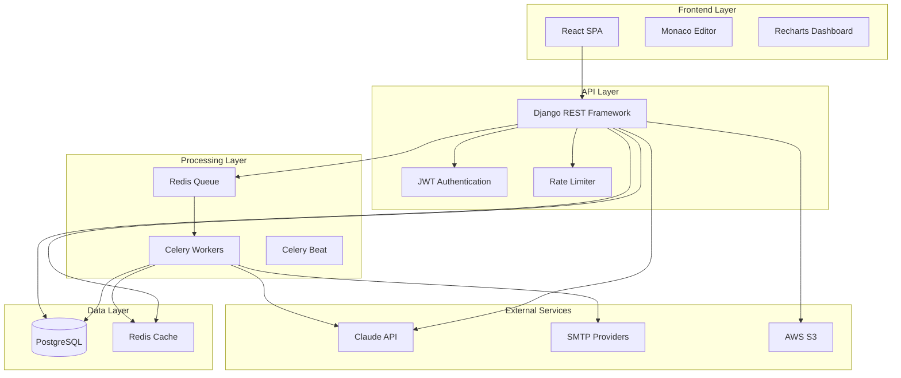
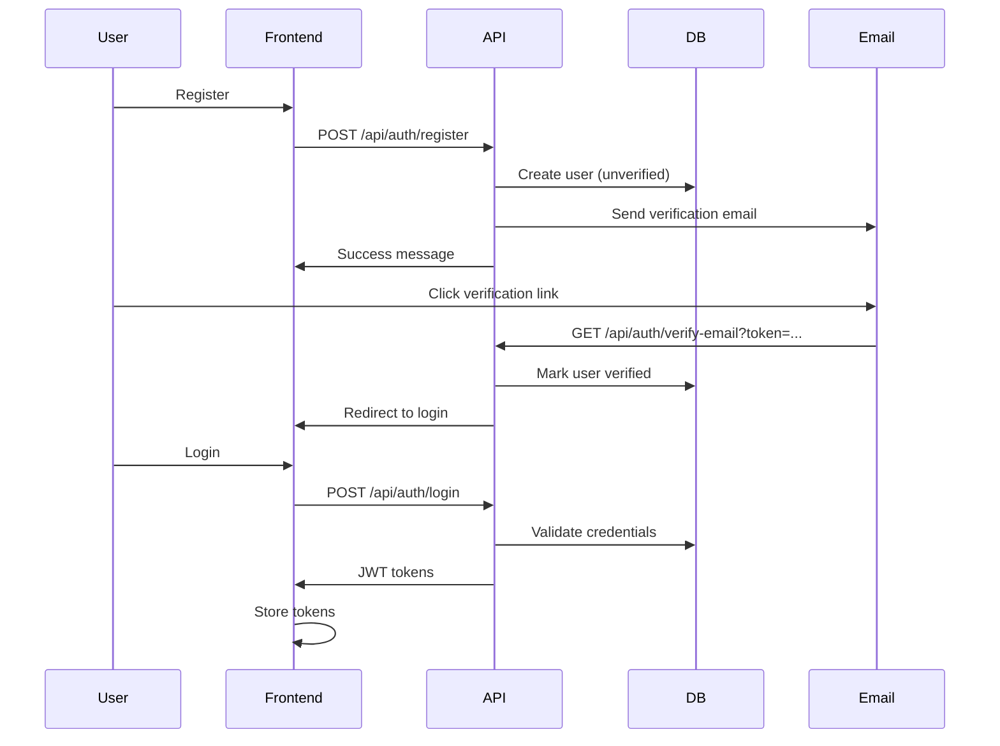
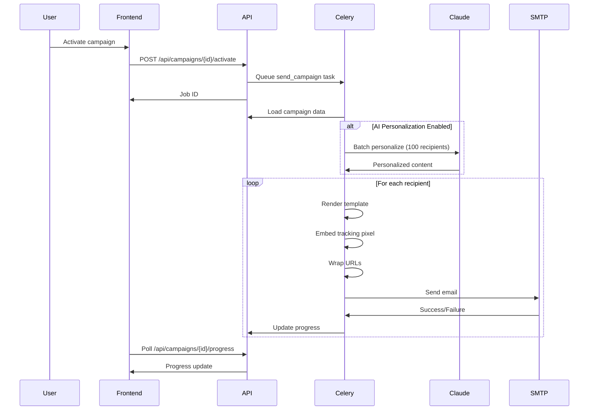

# Design Document: Bulk Email Sender

## Overview

The Bulk Email Sender is an AI-powered cold outreach platform that enables users to send personalized email campaigns at scale. The system consists of a React-based frontend, Django REST API backend, Celery-based asynchronous job processing, and Claude AI integration for content optimization.

The platform handles the complete email campaign lifecycle: user authentication, SMTP configuration, recipient list management, template creation, AI-powered personalization, bulk sending with tracking, and comprehensive analytics. The architecture prioritizes scalability (1000+ emails/minute), reliability (retry mechanisms), and deliverability (spam analysis, tracking).

Key technical characteristics:
- Asynchronous processing for bulk operations (Celery + Redis)
- Encrypted credential storage for SMTP configurations
- Real-time progress tracking via WebSocket or polling
- AI integration with rate limiting and fallback handling
- Comprehensive email tracking (opens, clicks, bounces)

## Architecture

### System Components



### Component Responsibilities

**Frontend (React + Vite)**
- User interface for campaign management
- Template editor with syntax highlighting (Monaco)
- Real-time analytics dashboard (Recharts)
- State management (Zustand) and data fetching (TanStack Query)

**Backend API (Django + DRF)**
- RESTful API endpoints for all operations
- JWT-based authentication with token refresh
- Request validation and rate limiting
- SMTP credential encryption/decryption
- CSV parsing and validation
- AI service orchestration

**Job Queue (Celery + Redis)**
- Asynchronous email sending with retry logic
- Scheduled campaign execution
- Batch processing for AI personalization
- Progress tracking and status updates

**AI Engine (Claude API)**
- Subject line generation (5 alternatives)
- Email content personalization per recipient
- Spam score analysis with recommendations

**Data Storage**
- PostgreSQL: User data, campaigns, templates, recipients, analytics
- Redis: Job queue, caching, real-time progress
- S3: CSV file uploads, tracking pixel images

### Communication Patterns

- Frontend ↔ Backend: REST API over HTTPS with JWT tokens
- Backend ↔ Celery: Task queue via Redis broker
- Backend ↔ Claude: HTTP API calls with retry logic
- Backend ↔ SMTP: Direct SMTP protocol or provider SDKs
- Real-time updates: Polling or WebSocket for campaign progress

## Components and Interfaces

### Authentication Service

**Responsibilities:**
- User registration with email verification
- Password hashing and validation
- JWT token generation and validation
- Rate limiting on auth endpoints

**API Endpoints:**
```
POST /api/auth/register
  Request: { email, password }
  Response: { message: "Verification email sent" }

POST /api/auth/verify-email
  Request: { token }
  Response: { message: "Email verified" }

POST /api/auth/login
  Request: { email, password }
  Response: { access_token, refresh_token, expires_in }

POST /api/auth/refresh
  Request: { refresh_token }
  Response: { access_token, expires_in }
```

**Security Requirements:**
- Password: min 8 chars, mixed case, numbers
- JWT expiration: 1 hour
- Rate limit: 5 attempts/minute
- HTTPS enforcement

### SMTP Configuration Service

**Responsibilities:**
- Store and manage multiple SMTP configurations per user
- Encrypt credentials before database storage
- Validate SMTP settings by sending test emails
- Support Gmail, SendGrid, Mailgun, custom SMTP

**API Endpoints:**
```
POST /api/smtp-configs
  Request: { name, provider, host, port, username, password, use_tls }
  Response: { id, name, provider, is_validated, created_at }

GET /api/smtp-configs
  Response: [{ id, name, provider, is_validated, created_at }]

PUT /api/smtp-configs/{id}
  Request: { name?, username?, password?, ... }
  Response: { id, name, provider, is_validated, updated_at }

POST /api/smtp-configs/{id}/test
  Request: { test_email }
  Response: { success, message }

DELETE /api/smtp-configs/{id}
  Response: { success }
```

**Data Model:**
```python
class SMTPConfig:
    id: UUID
    user_id: UUID
    name: str
    provider: str  # gmail, sendgrid, mailgun, custom
    host: str
    port: int
    username: str
    encrypted_password: bytes
    use_tls: bool
    is_validated: bool
    created_at: datetime
    updated_at: datetime
```

### Recipient List Service

**Responsibilities:**
- Parse CSV files and extract email addresses
- Validate email formats (RFC 5322)
- Deduplicate emails within lists
- Store recipient metadata (name, company, custom fields)
- Handle files up to 10MB, process 10K recipients in <30s

**API Endpoints:**
```
POST /api/recipient-lists
  Request: multipart/form-data { name, csv_file }
  Response: { id, name, total_count, valid_count, invalid_count, status }

GET /api/recipient-lists
  Response: [{ id, name, total_count, created_at }]

GET /api/recipient-lists/{id}
  Response: { id, name, recipients: [{ email, metadata }], created_at }

GET /api/recipient-lists/{id}/invalid
  Response: [{ email, error_reason }]

DELETE /api/recipient-lists/{id}
  Response: { success }
```

**CSV Processing:**
- Expected columns: email (required), name, company, custom fields
- Validation: RFC 5322 email format
- Deduplication: case-insensitive email matching
- Error handling: flag invalid emails, continue processing

### Template Service

**Responsibilities:**
- CRUD operations for email templates
- Variable syntax validation ({{variable_name}})
- Template preview with sample data
- Version control for templates
- Template duplication

**API Endpoints:**
```
POST /api/templates
  Request: { name, subject, body, variables }
  Response: { id, name, subject, body, version, created_at }

GET /api/templates
  Response: [{ id, name, subject, version, created_at }]

GET /api/templates/{id}
  Response: { id, name, subject, body, variables, version, created_at }

PUT /api/templates/{id}
  Request: { name?, subject?, body? }
  Response: { id, name, subject, body, version, updated_at }

POST /api/templates/{id}/preview
  Request: { sample_data: { name: "John", company: "Acme" } }
  Response: { rendered_subject, rendered_body }

POST /api/templates/{id}/duplicate
  Response: { id, name: "Copy of ...", ... }

DELETE /api/templates/{id}
  Response: { success }
```

**Variable Syntax:**
- Format: `{{variable_name}}`
- Validation: Check for matching braces, valid identifiers
- Supported variables: Any key from recipient metadata

### AI Service

**Responsibilities:**
- Generate 5 subject line alternatives (<3s)
- Personalize email content per recipient (100 recipients in <60s)
- Analyze spam score and provide recommendations (<2s)
- Handle API failures gracefully

**API Endpoints:**
```
POST /api/ai/generate-subjects
  Request: { email_body, context? }
  Response: { subjects: [string, string, ...], generation_time_ms }

POST /api/ai/personalize
  Request: { template_id, recipient_ids: [UUID], enable_personalization }
  Response: { job_id, status: "processing" }

GET /api/ai/personalize/{job_id}
  Response: { status, results: [{ recipient_id, personalized_content }] }

POST /api/ai/spam-check
  Request: { subject, body }
  Response: { 
    score: 0-100, 
    recommendations: [string],
    trigger_words: [string]
  }
```

**Claude Integration:**
- API: Anthropic Claude API
- Model: claude-3-sonnet or claude-3-haiku for speed
- Rate limiting: Handle 429 responses with exponential backoff
- Timeout: 10s per request
- Error handling: Return descriptive errors to user

### Campaign Service

**Responsibilities:**
- Create and manage campaigns
- Associate campaigns with recipient lists and templates
- Validate campaign configuration before activation
- Support draft and scheduled campaigns
- Trigger bulk sending jobs

**API Endpoints:**
```
POST /api/campaigns
  Request: { 
    name, 
    subject, 
    template_id, 
    recipient_list_id, 
    smtp_config_id,
    scheduled_at?,
    enable_ai_personalization
  }
  Response: { id, name, status: "draft", created_at }

GET /api/campaigns
  Response: [{ id, name, status, recipient_count, created_at }]

GET /api/campaigns/{id}
  Response: { 
    id, name, status, template, recipient_list, smtp_config,
    scheduled_at, enable_ai_personalization, created_at
  }

PUT /api/campaigns/{id}
  Request: { name?, subject?, ... }
  Response: { id, name, status, updated_at }

POST /api/campaigns/{id}/activate
  Response: { id, status: "queued", job_id }

GET /api/campaigns/{id}/progress
  Response: { 
    total, sent, failed, pending,
    progress_percentage, estimated_completion
  }

DELETE /api/campaigns/{id}
  Response: { success }
```

**Campaign States:**
- draft: Editable, not scheduled
- scheduled: Queued for future sending
- queued: Submitted to job queue
- sending: Actively processing
- completed: All emails processed
- failed: Critical error occurred

### Email Sending Service (Celery)

**Responsibilities:**
- Process campaigns asynchronously
- Send emails at 1000+/minute rate
- Embed tracking pixels with unique IDs
- Wrap URLs with click trackers
- Retry failed sends (3 attempts, exponential backoff)
- Log all send attempts with status
- Update real-time progress metrics

**Celery Tasks:**
```python
@celery.task
def send_campaign(campaign_id: UUID):
    """Main task to orchestrate campaign sending"""
    # Load campaign, recipients, template
    # If AI personalization enabled, batch personalize
    # Create send jobs for each recipient
    # Update progress tracking
    
@celery.task(bind=True, max_retries=3)
def send_email(self, campaign_id: UUID, recipient_id: UUID, content: dict):
    """Send individual email with retry logic"""
    try:
        # Render template with recipient data
        # Embed tracking pixel
        # Wrap URLs with click trackers
        # Send via SMTP
        # Log success
    except SMTPException as exc:
        # Exponential backoff: 60s, 120s, 240s
        raise self.retry(exc=exc, countdown=60 * (2 ** self.request.retries))
```

**Tracking Implementation:**
- Tracking pixel: ``
- Click tracking: Replace `href="https://example.com"` with `href="https://domain.com/track/click/{unique_id}?url=https://example.com"`
- Unique ID: UUID per recipient per campaign

**Rate Limiting:**
- Use Celery rate limits: `@task(rate_limit='1000/m')`
- Respect SMTP provider limits
- Implement token bucket for fine-grained control

### Tracking Service

**Responsibilities:**
- Record email opens via tracking pixel requests
- Record link clicks via click tracker redirects
- Store bounce notifications from SMTP providers
- Provide analytics data for dashboard

**API Endpoints:**
```
GET /track/open/{tracking_id}
  Response: 1x1 transparent PNG

GET /track/click/{tracking_id}?url={encoded_url}
  Response: 302 redirect to original URL

POST /api/webhooks/bounce
  Request: { email, bounce_type, reason }
  Response: { success }

GET /api/campaigns/{id}/analytics
  Response: {
    total_sent, total_opened, total_clicked, total_bounced,
    open_rate, click_rate, bounce_rate,
    opens_over_time: [{ timestamp, count }],
    clicks_over_time: [{ timestamp, count }]
  }
```

**Analytics Calculations:**
- Open rate: (unique opens / total sent) * 100
- Click rate: (unique clicks / total sent) * 100
- Bounce rate: (total bounced / total sent) * 100

## Data Models

### User
```python
class User:
    id: UUID
    email: str (unique, indexed)
    password_hash: str
    is_email_verified: bool
    email_verification_token: str?
    created_at: datetime
    updated_at: datetime
```

### SMTPConfig
```python
class SMTPConfig:
    id: UUID
    user_id: UUID (foreign key, indexed)
    name: str
    provider: str  # gmail, sendgrid, mailgun, custom
    host: str
    port: int
    username: str
    encrypted_password: bytes
    use_tls: bool
    is_validated: bool
    created_at: datetime
    updated_at: datetime
```

### RecipientList
```python
class RecipientList:
    id: UUID
    user_id: UUID (foreign key, indexed)
    name: str
    total_count: int
    valid_count: int
    invalid_count: int
    csv_file_url: str  # S3 URL
    status: str  # processing, completed, failed
    created_at: datetime
```

### Recipient
```python
class Recipient:
    id: UUID
    recipient_list_id: UUID (foreign key, indexed)
    email: str (indexed)
    metadata: JSONB  # { name, company, custom_field1, ... }
    is_valid: bool
    validation_error: str?
    created_at: datetime
```

### Template
```python
class Template:
    id: UUID
    user_id: UUID (foreign key, indexed)
    name: str
    subject: str
    body: text
    variables: JSONB  # [{ name, description }]
    version: int
    created_at: datetime
    updated_at: datetime
```

### Campaign
```python
class Campaign:
    id: UUID
    user_id: UUID (foreign key, indexed)
    name: str
    subject: str
    template_id: UUID (foreign key)
    recipient_list_id: UUID (foreign key)
    smtp_config_id: UUID (foreign key)
    enable_ai_personalization: bool
    status: str  # draft, scheduled, queued, sending, completed, failed
    scheduled_at: datetime?
    started_at: datetime?
    completed_at: datetime?
    total_recipients: int
    sent_count: int
    failed_count: int
    created_at: datetime
    updated_at: datetime
```

### EmailLog
```python
class EmailLog:
    id: UUID
    campaign_id: UUID (foreign key, indexed)
    recipient_id: UUID (foreign key, indexed)
    tracking_id: UUID (unique, indexed)
    status: str  # sent, failed, bounced
    error_message: str?
    sent_at: datetime?
    retry_count: int
    created_at: datetime
```

### EmailEvent
```python
class EmailEvent:
    id: UUID
    email_log_id: UUID (foreign key, indexed)
    tracking_id: UUID (indexed)
    event_type: str  # open, click
    event_data: JSONB  # { url, user_agent, ip_address }
    created_at: datetime (indexed)
```

### Database Indexes
- User: email (unique)
- SMTPConfig: user_id
- RecipientList: user_id
- Recipient: recipient_list_id, email
- Template: user_id
- Campaign: user_id, status
- EmailLog: campaign_id, recipient_id, tracking_id (unique)
- EmailEvent: email_log_id, tracking_id, created_at

## API Design

### Authentication Flow



### Campaign Execution Flow



### REST API Conventions

**Request/Response Format:**
- Content-Type: application/json
- Authentication: Bearer {jwt_token}
- Timestamps: ISO 8601 format (UTC)

**Error Response Format:**
```json
{
  "error": {
    "code": "VALIDATION_ERROR",
    "message": "Invalid email format",
    "details": {
      "field": "email",
      "value": "invalid-email"
    }
  }
}
```

**Pagination:**
```
GET /api/campaigns?page=1&page_size=20
Response: {
  "results": [...],
  "total": 150,
  "page": 1,
  "page_size": 20,
  "total_pages": 8
}
```

**Rate Limiting Headers:**
```
X-RateLimit-Limit: 100
X-RateLimit-Remaining: 95
X-RateLimit-Reset: 1640000000
```

## Implementation Approach

### Phase 1: Core Infrastructure (Week 1-2)
1. Set up Django project with PostgreSQL and Redis
2. Implement user authentication (registration, login, JWT)
3. Create base models and migrations
4. Set up Celery with Redis broker
5. Configure CORS and security middleware
6. Deploy basic infrastructure to staging

### Phase 2: SMTP and Recipient Management (Week 3)
1. Implement SMTP configuration CRUD
2. Add credential encryption (Fernet)
3. Build SMTP validation with test emails
4. Create CSV upload and parsing service
5. Implement email validation (RFC 5322)
6. Add recipient list management endpoints

### Phase 3: Templates and AI Integration (Week 4)
1. Build template CRUD with variable validation
2. Integrate Claude API client
3. Implement subject line generation
4. Add spam score analysis
5. Create AI personalization batch processing
6. Add error handling and rate limiting for AI calls

### Phase 4: Campaign Management (Week 5)
1. Implement campaign CRUD operations
2. Add campaign validation logic
3. Build campaign activation endpoint
4. Create Celery task for campaign orchestration
5. Implement email sending with retry logic
6. Add tracking pixel and click tracker generation

### Phase 5: Tracking and Analytics (Week 6)
1. Build tracking pixel endpoint
2. Implement click tracker with redirect
3. Create email event logging
4. Build analytics aggregation queries
5. Add real-time progress tracking
6. Implement webhook for bounce handling

### Phase 6: Frontend Development (Week 7-8)
1. Set up React + Vite + Tailwind
2. Build authentication pages
3. Create SMTP configuration UI
4. Build recipient list upload interface
5. Implement template editor (Monaco)
6. Create campaign creation wizard
7. Build analytics dashboard (Recharts)

### Phase 7: Testing and Optimization (Week 9)
1. Write unit tests for core services
2. Add integration tests for API endpoints
3. Implement property-based tests
4. Performance testing for bulk sending
5. Security audit and penetration testing
6. Load testing with 10K+ recipients

### Phase 8: Deployment and Monitoring (Week 10)
1. Set up Docker containers
2. Configure AWS/Render deployment
3. Set up monitoring (Sentry, CloudWatch)
4. Configure backup and disaster recovery
5. Production deployment
6. Documentation and user guides

### Technology Decisions

**Why Django + DRF:**
- Mature ORM with excellent PostgreSQL support
- Built-in admin interface for debugging
- Strong security features (CSRF, XSS protection)
- Extensive ecosystem for email, celery, etc.

**Why Celery + Redis:**
- Proven solution for distributed task processing
- Excellent retry and error handling
- Supports rate limiting and scheduling
- Redis provides both queue and caching

**Why Claude API:**
- State-of-art language model for personalization
- Fast response times (suitable for real-time use)
- Strong instruction following for structured tasks
- Reasonable pricing for bulk operations

**Why React + Vite:**
- Fast development with HMR
- Modern build tooling
- Large ecosystem (shadcn/ui, TanStack Query)
- Excellent TypeScript support

### Security Considerations

**Credential Protection:**
- SMTP passwords encrypted with Fernet (symmetric encryption)
- Encryption key stored in environment variable
- Never log or expose credentials in API responses

**Authentication Security:**
- Password hashing with bcrypt (cost factor 12)
- JWT tokens with short expiration (1 hour)
- Refresh tokens stored securely
- Rate limiting on auth endpoints (5/minute)

**Email Security:**
- Validate all email addresses before sending
- Implement unsubscribe mechanism (required by law)
- Track and respect bounce notifications
- Support SPF/DKIM/DMARC verification

**API Security:**
- HTTPS enforcement in production
- CORS configuration for frontend domain only
- Input validation on all endpoints
- SQL injection prevention via ORM
- XSS prevention via content sanitization

**Data Privacy:**
- User data isolation (row-level security)
- Soft delete for recipient lists
- GDPR compliance (data export, deletion)
- Audit logging for sensitive operations

### Scalability Considerations

**Horizontal Scaling:**
- Stateless API servers (scale with load balancer)
- Multiple Celery workers (scale based on queue depth)
- Redis cluster for high availability
- PostgreSQL read replicas for analytics queries

**Performance Optimization:**
- Database connection pooling
- Redis caching for frequently accessed data
- Batch processing for AI personalization
- Async I/O for SMTP connections
- CDN for tracking pixel images

**Rate Limiting:**
- Per-user API rate limits
- SMTP provider rate limits
- Claude API rate limits with backoff
- Queue throttling to prevent overload

### Monitoring and Observability

**Metrics to Track:**
- Email send rate (emails/minute)
- Campaign completion time
- SMTP success/failure rates
- AI API latency and error rates
- Database query performance
- Celery queue depth

**Logging:**
- Structured logging (JSON format)
- Log levels: DEBUG, INFO, WARNING, ERROR
- Centralized logging (CloudWatch, Datadog)
- Sensitive data redaction

**Alerting:**
- High error rates (>5%)
- Queue backlog (>1000 tasks)
- SMTP failures (>10%)
- AI API failures
- Database connection issues


## Correctness Properties

*A property is a characteristic or behavior that should hold true across all valid executions of a system-essentially, a formal statement about what the system should do. Properties serve as the bridge between human-readable specifications and machine-verifiable correctness guarantees.*

### Property 1: Password Complexity Enforcement

*For any* password input during registration, the system should accept it only if it contains at least 8 characters with mixed case letters and numbers, and reject all others.

**Validates: Requirements 1.2**

### Property 2: Email Verification Sent on Registration

*For any* valid user registration, the system should send an email verification link to the provided email address.

**Validates: Requirements 1.3**

### Property 3: JWT Token Expiration

*For any* successful authentication, the issued JWT token should have an expiration time of exactly 1 hour from issuance.

**Validates: Requirements 1.4**

### Property 4: Expired Token Rejection

*For any* JWT token that has passed its expiration time, the system should reject authentication attempts and require re-authentication.

**Validates: Requirements 1.5**

### Property 5: Authentication Rate Limiting

*For any* sequence of more than 5 authentication attempts from the same source within 1 minute, the system should reject subsequent attempts until the time window resets.

**Validates: Requirements 1.6**

### Property 6: SMTP Credential Encryption

*For any* SMTP configuration saved to the database, the password field should be stored in encrypted form, never as plaintext.

**Validates: Requirements 2.2**

### Property 7: SMTP Validation Error Messages

*For any* SMTP validation failure, the system should return a descriptive error message indicating the specific failure reason.

**Validates: Requirements 2.4**

### Property 8: CSV Email Extraction

*For any* valid CSV file uploaded, the system should parse and extract all email addresses from the designated email column.

**Validates: Requirements 3.1**

### Property 9: Email Validation and Flagging

*For any* email address in an uploaded recipient list, the system should validate it against RFC 5322 standards and flag any invalid addresses with specific error reasons.

**Validates: Requirements 3.2, 3.3**

### Property 10: Email Deduplication

*For any* recipient list with duplicate email addresses (case-insensitive), the system should store only unique emails in the final list.

**Validates: Requirements 3.4**

### Property 11: Recipient Metadata Preservation

*For any* CSV file with additional columns beyond email, the system should extract and store all column data as recipient metadata.

**Validates: Requirements 3.5**


### Property 12: Template Variable Rendering

*For any* email template containing personalization variables ({{variable_name}}) and recipient data, rendering should replace all variables with corresponding values from the recipient metadata.

**Validates: Requirements 4.2**

### Property 13: Template Syntax Validation

*For any* template save operation, the system should validate that all variable syntax is correct (matching braces, valid identifiers) and reject templates with syntax errors.

**Validates: Requirements 4.3**

### Property 14: Template Version Increment

*For any* template update operation, the system should increment the version number, maintaining a history of template changes.

**Validates: Requirements 4.5**

### Property 15: Subject Line Generation Count

*For any* subject line generation request, the AI engine should return exactly 5 alternative subject lines.

**Validates: Requirements 5.1**

### Property 16: AI Service Error Handling

*For any* AI service failure (unavailable, timeout, rate limit), the system should return a descriptive error message to the user rather than crashing or hanging.

**Validates: Requirements 5.5**

### Property 17: AI Personalization Uses Metadata

*For any* email personalization request with AI enabled, the generated content should incorporate the provided recipient metadata fields (name, company, custom fields).

**Validates: Requirements 6.1**

### Property 18: Template-Only Mode

*For any* campaign with AI personalization disabled, email rendering should use only template variable substitution without AI modification.

**Validates: Requirements 6.5**

### Property 19: Spam Score Range Validation

*For any* spam analysis result, the deliverability score should be a numeric value between 0 and 100 inclusive.

**Validates: Requirements 7.2**

### Property 20: Spam Analysis Completeness

*For any* spam analysis request, the response should include both specific recommendations for improvement and a list of identified spam trigger words.

**Validates: Requirements 7.3, 7.4**

### Property 21: Campaign-Recipient Association

*For any* created campaign, it should maintain a valid reference to exactly one recipient list throughout its lifecycle.

**Validates: Requirements 8.2**

### Property 22: Campaign Activation Validation

*For any* campaign activation attempt, the system should validate that all required fields (name, subject, template, recipient list, SMTP config) are populated and reject incomplete campaigns.

**Validates: Requirements 8.4**

### Property 23: Background Job Creation

*For any* campaign activation, the system should create and queue a background job for asynchronous email sending rather than blocking the API request.

**Validates: Requirements 9.1**


### Property 24: Unique Tracking Pixel Embedding

*For any* email sent as part of a campaign, the system should embed a tracking pixel with a unique identifier that is different from all other emails in the campaign.

**Validates: Requirements 9.3**

### Property 25: URL Click Tracking

*For any* URL present in an email template, the system should wrap it with a click tracker link that logs clicks before redirecting to the original destination.

**Validates: Requirements 9.4**

### Property 26: Email Send Retry Logic

*For any* failed email send attempt, the system should retry up to 3 times with exponential backoff (60s, 120s, 240s) before marking it as permanently failed.

**Validates: Requirements 9.5**

### Property 27: Email Send Logging

*For any* email send attempt (successful or failed), the system should create a log entry with timestamp, status, and error message (if applicable).

**Validates: Requirements 9.6**

### Property 28: Campaign Progress Updates

*For any* active campaign, the system should update progress metrics (sent count, failed count, percentage) as each email is processed.

**Validates: Requirements 9.7**

## Error Handling

### Authentication Errors

**Invalid Credentials:**
- HTTP 401 Unauthorized
- Error code: `AUTH_INVALID_CREDENTIALS`
- Message: "Invalid email or password"
- Action: User should retry with correct credentials

**Expired Token:**
- HTTP 401 Unauthorized
- Error code: `AUTH_TOKEN_EXPIRED`
- Message: "Your session has expired. Please log in again."
- Action: Frontend should redirect to login and clear stored tokens

**Rate Limit Exceeded:**
- HTTP 429 Too Many Requests
- Error code: `AUTH_RATE_LIMIT_EXCEEDED`
- Message: "Too many authentication attempts. Please try again in X seconds."
- Action: User should wait before retrying

**Unverified Email:**
- HTTP 403 Forbidden
- Error code: `AUTH_EMAIL_NOT_VERIFIED`
- Message: "Please verify your email address before logging in."
- Action: Prompt user to check email or resend verification

### SMTP Configuration Errors

**Invalid Credentials:**
- HTTP 400 Bad Request
- Error code: `SMTP_INVALID_CREDENTIALS`
- Message: "SMTP authentication failed: [specific SMTP error]"
- Action: User should verify username/password with provider

**Connection Failure:**
- HTTP 400 Bad Request
- Error code: `SMTP_CONNECTION_FAILED`
- Message: "Could not connect to SMTP server: [host:port]"
- Action: User should verify host, port, and TLS settings

**Test Email Failure:**
- HTTP 400 Bad Request
- Error code: `SMTP_TEST_FAILED`
- Message: "Test email could not be sent: [reason]"
- Action: User should check configuration and try again

### CSV Upload Errors

**File Too Large:**
- HTTP 413 Payload Too Large
- Error code: `CSV_FILE_TOO_LARGE`
- Message: "CSV file exceeds 10MB limit. Current size: X MB"
- Action: User should split file or remove unnecessary columns

**Invalid Format:**
- HTTP 400 Bad Request
- Error code: `CSV_INVALID_FORMAT`
- Message: "Could not parse CSV file. Please ensure it's properly formatted."
- Action: User should verify CSV structure and encoding

**Missing Email Column:**
- HTTP 400 Bad Request
- Error code: `CSV_MISSING_EMAIL_COLUMN`
- Message: "CSV must contain an 'email' column"
- Action: User should add email column or map existing column

**All Emails Invalid:**
- HTTP 400 Bad Request
- Error code: `CSV_NO_VALID_EMAILS`
- Message: "No valid email addresses found in CSV"
- Action: User should verify email format in source file


### Template Errors

**Invalid Variable Syntax:**
- HTTP 400 Bad Request
- Error code: `TEMPLATE_INVALID_SYNTAX`
- Message: "Invalid variable syntax at position X: [details]"
- Action: User should fix variable syntax (ensure {{variable}} format)

**Missing Required Variables:**
- HTTP 400 Bad Request
- Error code: `TEMPLATE_MISSING_VARIABLES`
- Message: "Template references undefined variables: [list]"
- Action: User should ensure all variables exist in recipient metadata

**Rendering Failure:**
- HTTP 500 Internal Server Error
- Error code: `TEMPLATE_RENDER_FAILED`
- Message: "Could not render template: [reason]"
- Action: System should log error, user should contact support

### AI Service Errors

**API Unavailable:**
- HTTP 503 Service Unavailable
- Error code: `AI_SERVICE_UNAVAILABLE`
- Message: "AI service is temporarily unavailable. Please try again later."
- Action: System should retry with exponential backoff, user should wait

**Rate Limit Exceeded:**
- HTTP 429 Too Many Requests
- Error code: `AI_RATE_LIMIT_EXCEEDED`
- Message: "AI service rate limit exceeded. Please try again in X seconds."
- Action: System should queue request or user should wait

**Invalid Request:**
- HTTP 400 Bad Request
- Error code: `AI_INVALID_REQUEST`
- Message: "AI service rejected request: [reason]"
- Action: User should modify input (e.g., shorter content)

**Timeout:**
- HTTP 504 Gateway Timeout
- Error code: `AI_TIMEOUT`
- Message: "AI service request timed out after 10 seconds"
- Action: System should retry, user should try again

### Campaign Errors

**Incomplete Configuration:**
- HTTP 400 Bad Request
- Error code: `CAMPAIGN_INCOMPLETE`
- Message: "Campaign missing required fields: [list]"
- Action: User should complete all required fields before activation

**Invalid Recipient List:**
- HTTP 400 Bad Request
- Error code: `CAMPAIGN_INVALID_RECIPIENTS`
- Message: "Recipient list contains no valid emails"
- Action: User should upload a valid recipient list

**SMTP Not Configured:**
- HTTP 400 Bad Request
- Error code: `CAMPAIGN_NO_SMTP`
- Message: "No validated SMTP configuration selected"
- Action: User should configure and validate SMTP settings

**Already Active:**
- HTTP 409 Conflict
- Error code: `CAMPAIGN_ALREADY_ACTIVE`
- Message: "Campaign is already active or completed"
- Action: User should create a new campaign or duplicate existing

### Email Sending Errors

**SMTP Send Failure:**
- Logged internally, not returned to user
- Error code: `EMAIL_SEND_FAILED`
- Message: "[SMTP error details]"
- Action: System retries up to 3 times, then marks as failed

**Recipient Rejected:**
- Logged internally
- Error code: `EMAIL_RECIPIENT_REJECTED`
- Message: "Recipient rejected by server: [reason]"
- Action: System marks as bounced, no retry

**Connection Lost:**
- Logged internally
- Error code: `EMAIL_CONNECTION_LOST`
- Message: "SMTP connection lost during send"
- Action: System retries with exponential backoff

**Daily Limit Exceeded:**
- HTTP 429 Too Many Requests
- Error code: `EMAIL_DAILY_LIMIT_EXCEEDED`
- Message: "SMTP provider daily sending limit reached"
- Action: Campaign pauses, resumes next day or user switches provider

### General Error Handling Strategy

**Retry Policy:**
- Transient errors (network, timeout): Retry with exponential backoff
- Authentication errors: No retry, return to user immediately
- Rate limits: Respect retry-after headers, queue requests
- Permanent failures: Log, alert, no retry

**Error Logging:**
- All errors logged with context (user_id, campaign_id, timestamp)
- Sensitive data (passwords, tokens) redacted from logs
- Error aggregation for alerting on patterns
- Stack traces included for 5xx errors

**User Communication:**
- Clear, actionable error messages
- Avoid exposing internal implementation details
- Provide next steps or support contact
- Include error codes for support reference

**Graceful Degradation:**
- AI unavailable: Fall back to template-only mode
- SMTP failure: Pause campaign, notify user
- Database connection issues: Return cached data when possible
- Queue overload: Throttle new campaign activations


## Testing Strategy

### Dual Testing Approach

The testing strategy employs both unit tests and property-based tests as complementary approaches:

**Unit Tests** focus on:
- Specific examples that demonstrate correct behavior
- Integration points between components (API ↔ Database, API ↔ Celery)
- Edge cases and boundary conditions
- Error handling scenarios
- Mock external services (SMTP, Claude API)

**Property-Based Tests** focus on:
- Universal properties that hold for all inputs
- Comprehensive input coverage through randomization
- Invariants that must be maintained
- Round-trip properties (serialize/deserialize, encrypt/decrypt)

Together, these approaches provide comprehensive coverage: unit tests catch concrete bugs in specific scenarios, while property tests verify general correctness across a wide input space.

### Property-Based Testing Configuration

**Framework Selection:**
- Python: Hypothesis (mature, excellent Django integration)
- JavaScript/TypeScript: fast-check (for frontend validation)

**Test Configuration:**
- Minimum 100 iterations per property test (due to randomization)
- Deterministic seed for reproducibility in CI/CD
- Shrinking enabled to find minimal failing examples
- Timeout: 30 seconds per property test

**Property Test Tagging:**
Each property-based test must include a comment referencing the design document property:

```python
@given(password=st.text(min_size=1, max_size=50))
def test_password_complexity(password):
    """
    Feature: bulk-email-sender, Property 1: Password Complexity Enforcement
    For any password input, system accepts only if it meets complexity requirements
    """
    result = validate_password(password)
    meets_requirements = (
        len(password) >= 8 and
        any(c.isupper() for c in password) and
        any(c.islower() for c in password) and
        any(c.isdigit() for c in password)
    )
    assert result.is_valid == meets_requirements
```

### Test Coverage by Component

**Authentication Service:**
- Unit tests:
  - Registration with valid/invalid emails
  - Login with correct/incorrect credentials
  - Token refresh flow
  - Email verification flow
- Property tests:
  - Property 1: Password complexity enforcement
  - Property 2: Email verification sent on registration
  - Property 3: JWT token expiration
  - Property 4: Expired token rejection
  - Property 5: Authentication rate limiting

**SMTP Configuration Service:**
- Unit tests:
  - CRUD operations for SMTP configs
  - Test email sending
  - Provider-specific configurations (Gmail, SendGrid, Mailgun)
- Property tests:
  - Property 6: SMTP credential encryption
  - Property 7: SMTP validation error messages

**Recipient List Service:**
- Unit tests:
  - CSV parsing with various formats
  - Email validation edge cases (special characters, internationalized domains)
  - File size limits
  - Empty CSV handling
- Property tests:
  - Property 8: CSV email extraction
  - Property 9: Email validation and flagging
  - Property 10: Email deduplication
  - Property 11: Recipient metadata preservation

**Template Service:**
- Unit tests:
  - Template CRUD operations
  - Preview with sample data
  - Template duplication
  - Version history
- Property tests:
  - Property 12: Template variable rendering
  - Property 13: Template syntax validation
  - Property 14: Template version increment

**AI Service:**
- Unit tests:
  - Mock Claude API responses
  - Timeout handling
  - Rate limit handling
  - Fallback behavior
- Property tests:
  - Property 15: Subject line generation count
  - Property 16: AI service error handling
  - Property 17: AI personalization uses metadata
  - Property 18: Template-only mode
  - Property 19: Spam score range validation
  - Property 20: Spam analysis completeness

**Campaign Service:**
- Unit tests:
  - Campaign CRUD operations
  - State transitions (draft → queued → sending → completed)
  - Scheduled campaign execution
  - Campaign validation
- Property tests:
  - Property 21: Campaign-recipient association
  - Property 22: Campaign activation validation
  - Property 23: Background job creation

**Email Sending Service:**
- Unit tests:
  - Celery task execution
  - SMTP connection handling
  - Retry logic with mocked failures
  - Progress tracking
- Property tests:
  - Property 24: Unique tracking pixel embedding
  - Property 25: URL click tracking
  - Property 26: Email send retry logic
  - Property 27: Email send logging
  - Property 28: Campaign progress updates

**Tracking Service:**
- Unit tests:
  - Tracking pixel requests
  - Click tracker redirects
  - Bounce webhook handling
  - Analytics aggregation
- Property tests:
  - Round-trip: tracking ID generation and lookup
  - Analytics calculations (open rate, click rate)


### Integration Testing

**API Integration Tests:**
- Full request/response cycle for each endpoint
- Authentication middleware integration
- Rate limiting middleware integration
- Database transaction handling
- Error response formatting

**Celery Integration Tests:**
- Task queuing and execution
- Task retry behavior
- Task result storage
- Scheduled task execution
- Worker failure handling

**External Service Integration:**
- SMTP provider integration (use test accounts)
- Claude API integration (use test API keys with low rate limits)
- S3 integration (use test buckets)
- Redis integration (use test database)

### End-to-End Testing

**Critical User Flows:**
1. User registration → email verification → login
2. SMTP configuration → validation → test email
3. CSV upload → validation → recipient list creation
4. Template creation → preview → save
5. Campaign creation → AI personalization → activation → sending → analytics

**Test Environment:**
- Staging environment with production-like configuration
- Test SMTP provider (Mailtrap or similar)
- Test Claude API key with rate limits
- Isolated database and Redis instance
- Monitoring and logging enabled

### Performance Testing

**Load Testing Scenarios:**
- 10,000 recipient CSV upload and processing
- 1,000 emails/minute sending rate
- 100 concurrent API requests
- 1,000 concurrent tracking pixel requests
- AI personalization for 100 recipients

**Performance Targets:**
- CSV processing: <30s for 10,000 recipients
- Email sending: >1,000/minute sustained
- API response time: <200ms (p95)
- Tracking pixel response: <50ms (p95)
- AI subject generation: <3s
- AI spam analysis: <2s

**Tools:**
- Locust for load testing
- Django Debug Toolbar for profiling
- PostgreSQL EXPLAIN ANALYZE for query optimization
- Redis monitoring for queue depth

### Security Testing

**Vulnerability Scanning:**
- OWASP Top 10 coverage
- SQL injection testing (automated with sqlmap)
- XSS testing (automated with XSStrike)
- CSRF protection verification
- Authentication bypass attempts

**Penetration Testing:**
- Rate limit bypass attempts
- Token manipulation and replay attacks
- Privilege escalation attempts
- Data exposure through API endpoints
- SMTP credential extraction attempts

**Security Checklist:**
- [ ] All passwords hashed with bcrypt
- [ ] SMTP credentials encrypted at rest
- [ ] JWT tokens with short expiration
- [ ] HTTPS enforced in production
- [ ] CORS properly configured
- [ ] Input validation on all endpoints
- [ ] SQL injection prevention via ORM
- [ ] XSS prevention via content sanitization
- [ ] Rate limiting on all public endpoints
- [ ] Audit logging for sensitive operations

### Continuous Integration

**CI Pipeline:**
1. Lint code (flake8, black, isort for Python; ESLint, Prettier for JS)
2. Run unit tests with coverage (target: >80%)
3. Run property-based tests (100 iterations)
4. Run integration tests
5. Build Docker images
6. Deploy to staging
7. Run E2E tests on staging
8. Security scan (Snyk, Bandit)

**Test Execution:**
- Run on every pull request
- Block merge if tests fail
- Generate coverage reports
- Track test execution time
- Fail fast on critical errors

**Test Data Management:**
- Fixtures for common test scenarios
- Factory pattern for test object creation (factory_boy)
- Database reset between test runs
- Isolated test database per test suite
- Mock external services by default

### Monitoring and Observability in Production

**Metrics to Track:**
- Email send success/failure rates
- Campaign completion times
- API endpoint latency (p50, p95, p99)
- Celery queue depth and processing rate
- AI API latency and error rates
- Database query performance
- Redis memory usage

**Alerting Thresholds:**
- Email failure rate >5%
- API error rate >1%
- Queue depth >1000 tasks
- AI API error rate >10%
- Database connection pool exhaustion
- Redis memory >80%

**Logging Strategy:**
- Structured JSON logging
- Log levels: DEBUG (dev), INFO (staging), WARNING (prod)
- Centralized logging (CloudWatch, Datadog, or ELK)
- Sensitive data redaction (passwords, tokens, email content)
- Request ID tracking across services
- Performance logging for slow queries (>100ms)

### Test Maintenance

**Regular Activities:**
- Review and update test coverage quarterly
- Refactor flaky tests
- Update test data to reflect production patterns
- Review and optimize slow tests
- Update security test scenarios based on new threats
- Maintain test documentation

**Test Quality Metrics:**
- Code coverage: >80% overall, >90% for critical paths
- Test execution time: <5 minutes for unit tests, <15 minutes for full suite
- Flaky test rate: <1%
- Test maintenance burden: <10% of development time
